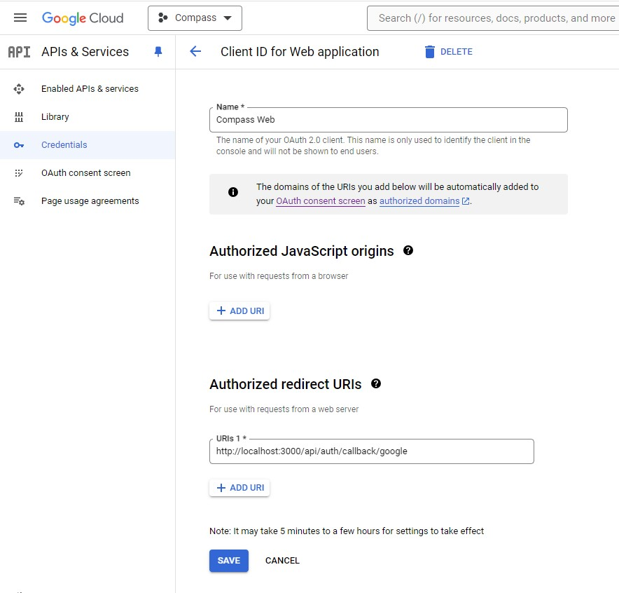

# 🧭 Project Compass

Compass is a tool to help educators create and manage Individualized Education Programs (IEPs) for better student outcome.

Useful resources:

- [Notion wiki](https://www.notion.so/sfbrigade/Compass-source-of-truth-db118a6d51344dccadc49d1988662d66)
- [Slack channel](https://sfbrigade.slack.com/archives/C01R8E75N1K)

## Contributing to our code base

### One time setup

1. Install [Docker Desktop](https://www.docker.com/products/docker-desktop/)
2. Clone the GitHub repo:

   - _Windows users (do this first before checkout)_ : make sure to run git autocrlf setting is set to false so that carriage return characters are not inserted into files (which breaks them when they run inside the Linux container). To do so, open a Powershell and run: `git config --global core.autocrlf false`
     <br>

   ```sh
   cd <parent folder of compass>
   git clone https://github.com/sfbrigade/compass.git
   cd compass
   ```

3. Create the local server env file:
   ```sh
   cp .env.example .env.local
   ```

### Running Compass

There are two ways to run Compass locally:

**Option 1: Run server locally, and supporting services in Docker**

1. Install node dependencies, starting in the `compass` directory

   ```sh
   npm install           # install dependencies
   ```

2. Start services in Docker & reset the database

   ```sh
   docker compose -f supporting_services/docker-compose.yml up -d  # start the services in the background
   npm run db:reset      # reset and migrate the database
   ```

3. Start the server

   ```sh
   npm run dev           # start the server in development mode
   ```

   Server URL: http://localhost:3000

   NOTE: If you get into a login loop, double check that the Docker services are running

4. Seed database (Optional)
   ````sh
   npm run db:seed           # Seed the database with test data
   ```                       # Must be done after login to Compass app
   ````

**Option 2: Run both server and supporting services locally**

1. One time setup:

- Install and configure Postgres:
  - install using [pgAdmin 4](https://www.postgresql.org/download/), [Homebrew](https://wiki.postgresql.org/wiki/Homebrew), or any other method
  - create a username and password on the Postgres server
  - update the `DATABASE_URL` in _.env.local_ to include your actual `<username>` and `<password>`:
    ```
    DATABASE_URL=postgres://<username>:<password>@localhost:5432/compass
    ```
- Install [MinIO](https://min.io), an open source S3-compatible storage server:
  - follow their guide for [macOS](https://min.io/docs/minio/macos/index.html) or [Windows](https://min.io/docs/minio/windows/index.html)
  - after installing and starting the MinIO server, make sure to create a new bucket and update the `S3_USER_UPLOADS_BUCKET_NAME` in _.env.local_ to match the name of the bucket you created:
    ```
    S3_USER_UPLOADS_BUCKET_NAME=<bucket-name>
    ```

2. Install dependencies, starting in the `compass` directory

   ```sh
   npm install           # install dependencies
   ```

3. Reset the database and bring up the server

   ```sh
   npm run db:reset      # reset and migrate the database
   npm run dev           # start the server in development mode
   ```

   Server URL: http://localhost:3000

### Authentication

.env.local file will need to be updated for sign in with Google

To update GOOGLE_CLIENT_ID:

- Navigate to Google Cloud
- Create a "Client ID for Web application"
- Populate the fields as below (note the name and authorized redirect URIs fields)
  

* Copy the client ID field on the upper right of the modal (not shown in screenshot), after creation

To update GOOGLE_CLIENT_SECRET:

- Copy the google client secret after creation of the client id

### Running tests

The database container does not need to be started to run tests, but Docker Desktop must be running in the background.

Run all tests with `npm run test`. An individual test file can be run with `npm run test <path/to/file>` (e.x. `npm run test src/routes/students.test.ts`).

To run tests in watch mode, use `npm run test:watch`. This will run tests whenever a file is changed, but will not take database schema changes into account.

### Database

#### Creating migrations

Until Compass is deployed, the initial migration file at `src/api/db/migrations/1_initial-migrations.sql` should be edited. Once Compass is deployed, new migrations can be created in the same directory by adding `1` to the number of the last migration file.

#### Running migrations

Run `npm run db:migrate` to migrate the database. However, until Compass is deployed, you'll more likely want to run `npm run db:reset` to reset the database since we'll be making changes to the initial migration file.

### Troubleshooting

Compass app is not running:

Make sure that Docker is running in the background

Client id is required:

Fill out the Google Client ID and Google Client Secret in .env.local

## Tech stack & libraries

- [Winston](https://github.com/winstonjs/winston)
- [PostgreSQL](https://www.postgresql.org/)
- [Kysely](https://github.com/koskimas/kysely) (type-safe SQL query builder)
- [Zapatos](https://github.com/jawj/zapatos) (type-safe Postgres helpers, mostly used to generate typings for Kysely)
- [AVA](https://github.com/avajs/ava) (test runner)
